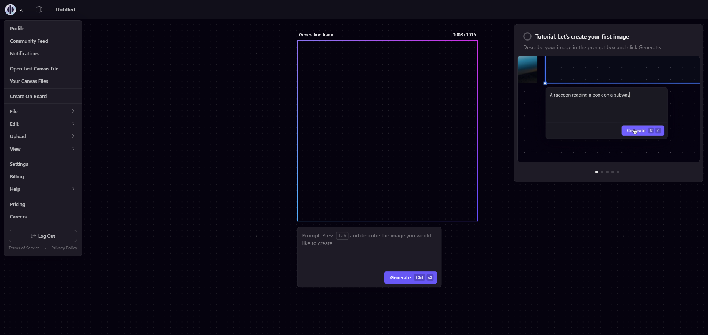
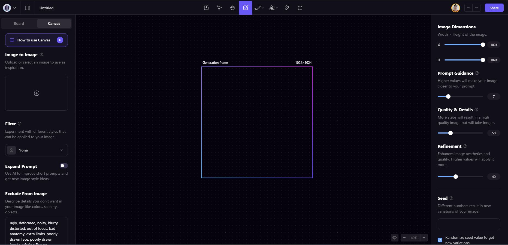
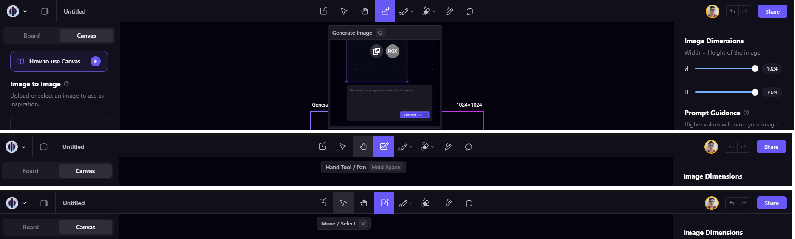

# Heurísticas de Nielsen para Avaliação de Usabilidade

Jakob Nielsen, um renomado especialista em usabilidade e design de interfaces, propôs 10 heurísticas de usabilidade que são princípios gerais para avaliar a qualidade de uma interface de usuário. Essas heurísticas são diretrizes de design que ajudam a identificar problemas potenciais e melhorar a usabilidade de um sistema. As 10 Heurísticas são: 

1. **Visibilidade do Estado do Sistema:**
   Informe o usuário sobre o que está acontecendo por meio de feedback apropriado em tempo real, como dizer em qual página ele está e de onde ele veio. Exemplos:
   - Opção de voltar à tela anterior com facilidade 
   - Mouse com 'Hover' em objetos clicáveis 
   - Mostrar uma barra de carregamento em processos demorados 

2. **Correspondência entre o Sistema e o Mundo Real:**
   Use terminologia e conceitos familiares para os usuários, evitando jargões técnicos desnecessários. Mantenha a linguagem alinhada com a experiência do usuário. Exemplos:
   - Ícones e imagens reconhecidos pelo usuário, como uma lixeira para exclusão 
   - Ícones e imagens que fazem referência ao mundo real, como um carrinho de supermercado para as compras 
   - Termos do contexto do usuário 

3. **Controle e Liberdade do Usuário:**
   Dê controle ao usuário sobre o sistema. Forneça aos usuários a capacidade de desfazer ações e sair de situações indesejadas. Exemplos:
   - Permitir que o usuário cancele uma ação 
   - Permitir fácil navegação pelas páginas, como em uma navbar 
   - Personalização de interface, como o modo escuro 

4. **Consistência e Padrões:**
   Mantenha consistência na apresentação de informações e no design de interação. Siga padrões de design já estabelecidos para garantir uma experiência mais intuitiva. Exemplos:
   - Logo com link para a tela Home 
   - Links e botões padronizados 
   - Posicionamento convencional de elementos, como botões de fechar (o famoso 'x') na parte superior direita de popups 

5. **Prevenção de Erros:**
   Projete interfaces de modo a prevenir erros, ou, caso ocorram, minimizar suas consequências, evitando ações prejudiciais. Exemplos:
   - Confirmações duplas 
   - regras de preenchimento em formulários, como digitar apenas números em um campo que requer o CPF 
   - Corretores ortográficos 

6. **Reconhecimento em Vez de Lembrança:**
   Faça com que objetos, ações e opções estejam visíveis e se destaquem, em vez de exigir que os usuários lembrem informações específicas. Isso facilita o uso do sistema. Exemplos:
   - Lembretes de informações 
   - Dicas visuais para as principais ações 
   - Reduzir Menus, e caso haja muitas opções, criar categorias ou submenus 

7. **Flexibilidade e Eficiência de Uso:**
   Ofereça atalhos e métodos alternativos para usuários experientes. Permita que usuários habilidosos realizem tarefas mais rapidamente, sem prejudicar a eficácia para usuários menos experientes. Exemplos:
   - Teclas de atalho 
   - Sugestões de preenchimento 
   - Histórico de preenchimento 

8. **Estética e Design Minimalista:**
   Mantenha a interface limpa e simples, eliminando informações desnecessárias ou elementos que não contribuem para a tarefa do usuário. Uma estética agradável pode melhorar a experiência do usuário. Exemplos:
   - Evitar muitas fontes 
   - Uma única paleta de cores 
   - Não mostrar informações desnecessárias, como o excesso de cards numa tela 

9. **Ajuda aos Usuários para Reconhecer, Diagnosticar e Recuperar Erros:**
   Forneça mensagens de erro claras e soluções para que os usuários possam entender e corrigir problemas rapidamente. Exemplos:
   - Não mostrar códigos de erro, preparar uma tela de erro 
   - Log interno do sistema 
   - Mostrar possíveis soluções para cada erro 

10. **Ajuda e Documentação:**
    Forneça ajuda e documentação quando necessário, mas projete a interface de modo que a maioria das tarefas possa ser realizada sem a necessidade de referência externa. Exemplos: 
   - Seção de perguntas frequentes 
   - Documentação 
   - Serviço de atendimento ao cliente 

Para facilitar o entendimento, aqui está um exemplo aplicado na prática:
As Inteligências Artificiais estão em alta ultimamente, por isso eu escolhi analisar uma delas nesse exercício sobre as Heurísticas de Usabilidade. A escolhida foi a Playground AI, uma IA gratuita de geração de imagens. A proposta dela é que você possa facilmente gerar uma imagem através de um prompt simples, em inglês. À primeira vista, o website da Playground parece muito bom, mas vamos ver algumas Heurísticas aplicadas nele. 

No site, há uma opção onde você pode gerar as imagens e editá-las num arquivo do tipo Canvas, mas observe os seguintes pontos dessa tela:

1 - Não há nenhuma indicação de que você está numa tela desse tipo na primeira vez que você a usa. Isso vai contra a primeira Heurística, sobre a visibilidade do estado do sistema. 

2 - Há um tutorial de como você pode usar as funcionalidades dessa tela, mas não um botão que permita você pular esse tutorial. Além disso, algumas funções são desbloqueadas somente depois de você concluir o tutorial. Mesmo que seja apenas na primeira vez que você usa o Canvas, caso um usuário tenha criado uma conta nova, ele ainda será obrigado a refazer o tutorial. Isso vai contra a terceira Heurística, sobre o controle e liberdade do usuário dentro do sistema. 

3 - Existe um Logo na parte superior esquerda, e ao clicar nele você expande o menu, que mostra todas as opções disponíveis dentro do sistema. Para ir para a tela 'Home', é preciso selecionar a opção 'Community Feed'. Caso você esteja no 'Board', onde pode criar as imagens de uma forma ligeiramente diferente do Canvas, existe uma opção no canto superior direito que te leva à tela 'Home' ('Community Feed'). Isso quer dizer que caso você esteja em uma tela, você pode acessar a tela inicial do sistema por um lugar diferente de onde poderia por outra tela, quebrando os padrões do sistema, e tornando o acesso ao feed de imagens da comunidade mais complexo em um dos casos. Isso vai contra a quarta Heurística, sobre consistência e padrões dentro do sistema. 

Primeiro Acesso à tela do tipo Canvas: 

Próximos Acessos à tela do tipo Canvas: 

Mas não tem apenas problemas com as Heurísticas no site. Ainda na tela do Canvas, na parte superior central, há algumas opções do que você pode fazer com uma imagem: 

1 – Quando você passa o mouse por algumas dessas funcionalidades, aparece uma dica do que ela é, e em alguns casos em que essa funcionalidade é mais complexa, aparece um vídeo explicativo. Isso é contemplado pela primeira Heurística, que fala sobre a visibilidade do estado do sistema. 

2 – Os ícones utilizados nessas opções também foram descritos em uma Heurística, a segunda, que é sobre a correspondência com o mundo real, já que esses ícones são autoexplicativos e são convenções do contexto das edições de imagens. 

3 – Uma outra coisa que aparece quando você passa o mouse por cima de algumas dessas opções é uma tecla de atalho para aquela funcionalidade, fazendo com que um usuário experiente no sistema possa agilizar seu trabalho sem atrapalhar a utilização de usuários mais novos, de acordo com a sétima Heurística, sobre a flexibilidade e eficiência de uso do sistema. 

Opções de Funcionalidades na tela do tipo Canvas: 

